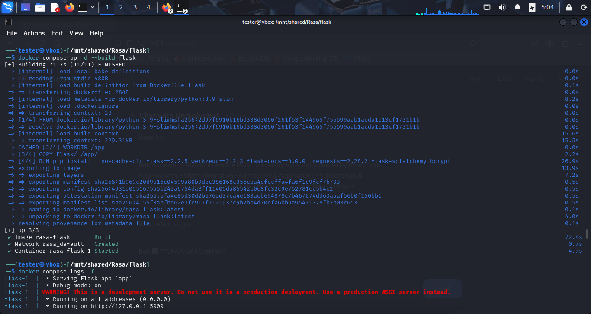
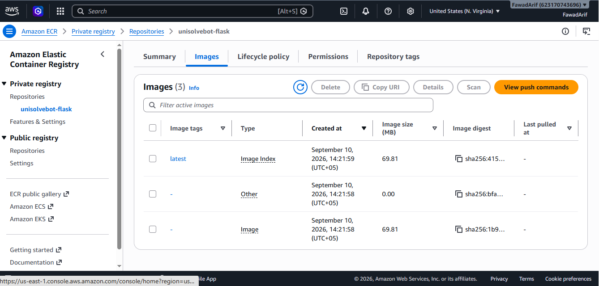
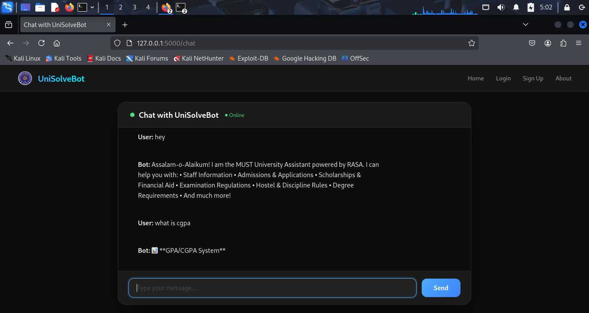

# UniSolveBot - University Assistant Chatbot (RASA + Flask)

A university assistant chatbot combining a Flask web layer (authentication, sessions) with a RASA-powered chatbot backend, containerized with Docker Compose, with cloud infrastructure provisioned via Terraform and deployed to AWS ECR.

---

## Overview

UniSolveBot lets registered users chat with an AI assistant trained to answer university-related questions - admissions, scholarships, exam regulations, hostel rules, degree requirements. Flask handles the web UI, user accounts, and sessions; RASA handles natural language understanding and dialogue.

- User registration and login with bcrypt-hashed passwords
- Session-based authentication (Flask sessions)
- SQLite database for user records, managed via SQLAlchemy ORM
- Real-time chat interface proxying messages to a RASA NLU server
- Infrastructure (AWS ECR) provisioned declaratively with Terraform
- Multi-container orchestration via Docker Compose

---

## Architecture

Browser
  |
  v
Flask App (auth, sessions, SQLite via SQLAlchemy)
  |
  v
/webhook route
  |
  v
RASA Server (NLU + dialogue) - container rasa-rasa, port 5005

Flask and RASA run as separate Docker containers, connected through Docker Compose's internal network.

---

## Tech Stack

Layer | Technology
Frontend | HTML/CSS templates (Flask-rendered)
Backend | Flask (Python)
Database | SQLite, SQLAlchemy (ORM)
Auth | bcrypt, Flask sessions
NLU/Chatbot | RASA
Containerization | Docker, Docker Compose
Infrastructure as Code | Terraform
Cloud Registry | AWS Elastic Container Registry
Dev Environment | Kali Linux (VM)

---

## Project Structure

Rasa/
|-- Flask/
|   |-- app.py              (Flask routes, auth, DB models, RASA proxy)
|   |-- templates/          (HTML pages: login, register, dashboard, chat)
|-- data/                   (RASA training data: nlu.yml, stories.yml, etc.)
|-- actions/                (RASA custom actions)
|-- infrastructure/
|   |-- main.tf             (Terraform config for AWS ECR)
|-- domain.yml              (RASA intents and responses)
|-- config.yml
|-- credentials.yml
|-- endpoints.yml
|-- Dockerfile.flask        (Flask app container build instructions)
|-- Dockerfile.rasa         (RASA container build instructions)
|-- docker-compose.yml
|___ README.md

---

## Infrastructure as Code (Terraform)

The ECR repository where the Docker images get pushed is defined in infrastructure/main.tf, version-controlled instead of set up manually through the AWS console.

resource "aws_ecr_repository" "unisolvebot" {
  name                 = "unisolvebot"
  image_tag_mutability = "MUTABLE"
}

To apply it:

cd infrastructure
terraform init
terraform plan
terraform apply

---

## Running Locally

git clone https://github.com/yourusername/unisolvebot-rasa-flask.git
cd unisolvebot-rasa-flask
docker compose up --build

Visit http://localhost:5000

---

## Deployment

docker tag rasa-flask:latest ecr-repo-uri:flask-latest
docker tag rasa-rasa:latest ecr-repo-uri:rasa-latest

docker push ecr-repo-uri:flask-latest
docker push ecr-repo-uri:rasa-latest

---

## What This Project Demonstrates

- Infrastructure as Code - AWS ECR provisioned via Terraform instead of manual console clicks
- Multi-container architecture separating web/auth logic from NLU/chatbot logic
- Secure password handling with bcrypt hashing
- Inter-container communication over Docker's internal network (service-name DNS)
- REST API integration - Flask calling RASA's webhook API
- Database modeling with SQLAlchemy ORM backed by SQLite
- Training and packaging a custom RASA NLU model inside a Docker image
- Publishing multiple related images to a private cloud container registry

---

## Screenshots

### Docker Compose Running

### AWS ECR - Pushed Image Repository

### Live Chat Interface

---

## Author

Fawad Arif - DevOps Engineer   
Fawad Arif — DevOps Engineer
LinkedIn: www.linkedin.com/in/fawad-ar1f
GitHub: https://github.com/FawadArif

